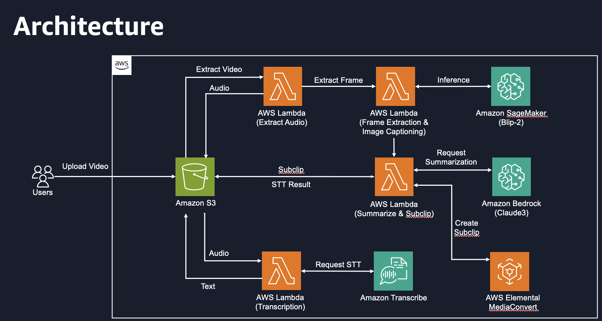

# 02. Solution Overview

## Architecture Overview

금일 실습에서 구성할 아키텍처는 다음과 같습니다.

<figure><figcaption></figcaption></figure>

1. 사용자는 요약할 비디오를 업로드합니다.
2. 업로드한 비디오는 Lambda를 통해 Audio를 추출합니다.
3. 추출한 Audio 파일을 Amazon Transcribe를 이용하여 얻은 결과를 S3에 저장합니다.
4. 비디오 파일에서 이미지 프레임을 추출하고 Blip-2를 이용하여 Image Captioning 결과를 추론합니다.
5. 추론된 Captioning 결과와 STT 결과를 Amazon Bedrock을 통해 영상의 주제를 선별합니다.
6. 선별된 영상은 AWS Elemental MediaConvert를 통해 Subclip을 생성합니다.

서비스를 구성하기 위한 Lambda 함수 및 SageMaker, Transcribe, Bedrock, Mediaconvert에 대해 실습을 진행하며 알아보겠습니다.

## Cost

* 비용 산정 기준
  * MPEG-4, AAC, H.264, 720x1280
  * 약 한시간 영상 (837MB)
* SageMaker Realtime endpoint
  * &#x20;1 models / 1 models per endpoint = 1.00 endpoint(s) endpoints rounded up by 1 (1.000000) = 1 endpoint(s) (rounded up) 1 endpoint(s) x 1 instances per endpoint x 1 hours per day x 1 day per month = 1.00 SageMaker Real-Time Inference hours per month 1.00 hours per month x 1.7318 USD per hour instance cost = 1.73 USD (monthly On-Demand cost) Total cost for Real-Time Inference (monthly): 1.73 USD
* Lambda : 1 USD
* Transcribe : 0.07 USD
* Claude sonnet
  *

      | Claude 3 Sonnet | 0.003 USD   | 0.015 USD   |
      | --------------- | ----------- | ----------- |
      | Claude 3 Haiku  | 0.00025 USD | 0.00125 USD |
  * input token (sonnet) : 약 8500 \* 0.03 / 1000 = 0.255 USD
  * output token (sonnet) : 약 500 \* 0.015 / 1000 = 0.0075 USD

