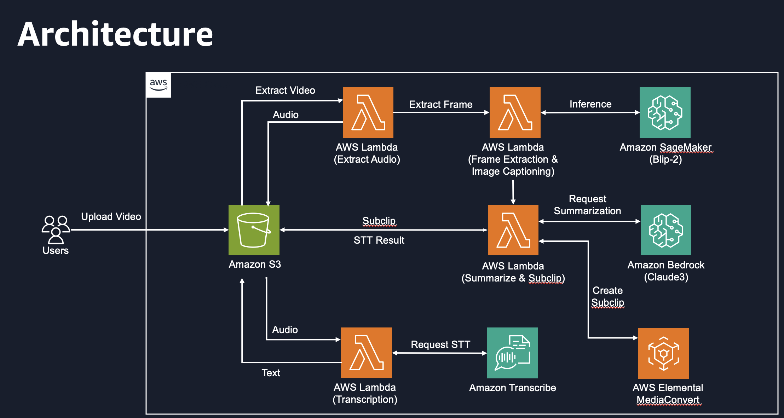

# 06. Wrap-up

지금까지 Video Summarization Hands-on 을 수행하시느라 고생하셨습니다.

금일 구성한 아키텍처와 workflow를 살펴보면 다음과 같습니다.

금일 실습에서 구성한 아키텍처는 다음과 같습니다.

<figure><figcaption></figcaption></figure>

1. 사용자는 요약할 비디오를 업로드합니다.
2. 업로드한 비디오는 Lambda를 통해 Audio를 추출합니다.
3. 추출한 Audio 파일을 Amazon Transcribe를 이용하여 얻은 결과를 S3에 저장합니다.
4. 비디오 파일에서 이미지 프레임을 추출하고 Blip-2를 이용하여 Image Captioning 결과를 추론합니다.
5. 추론된 Captioning 결과와 STT 결과를 Amazon Bedrock을 통해 영상의 주제를 선별합니다.
6. 선별된 영상은 AWS Elemental MediaConvert를 통해 Subclip을 생성합니다.

위 아키텍처는 변경할 수 있는 사항이 여러가지 있습니다.

* workflow orchestration 서비스 사용
  * managed airflow / step function&#x20;
  * [https://aws.amazon.com/ko/step-functions/](https://aws.amazon.com/ko/step-functions/)
  * [https://aws.amazon.com/ko/managed-workflows-for-apache-airflow/](https://aws.amazon.com/ko/managed-workflows-for-apache-airflow/)
* Autoscaling, Queue 등 추가
* 모델 변경
  * transcribe
  * llm model (blip, claude)

